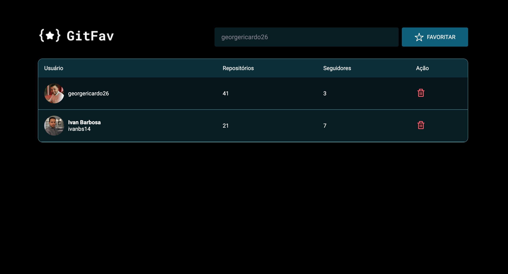
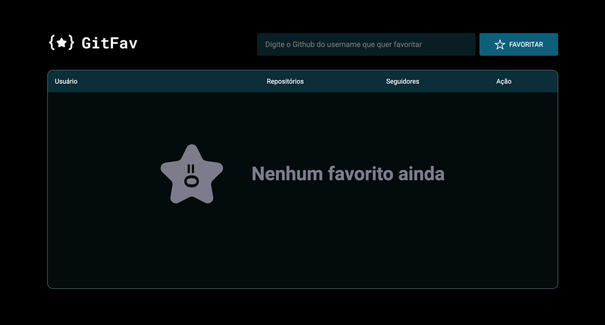

<h1 align="center"> GITHUB FAVORITOS</h1>

Desenvolvido por Ivan Barbosa. 
Layout UI/UX RocketSeat.

  <a href="#-tecnologias">Tecnologias</a>&nbsp;&nbsp;&nbsp;|&nbsp;&nbsp;&nbsp;
  <a href="#-projeto">Projeto</a>&nbsp;&nbsp;&nbsp;|&nbsp;&nbsp;&nbsp;
  <a href="#-layout">Layout</a>&nbsp;&nbsp;&nbsp;|&nbsp;&nbsp;&nbsp;
  <a href="#memo-licença">Licença</a>

  
  

 

## 🚀 Tecnologias

Esse projeto foi desenvolvido com as seguintes tecnologias:

- HTML
- CSS
- JavaScript
- Git e Github

## 💻 Projeto

Pagina onde o Cliente digita o usuario do GitHub.
Este usuario será consultado na API do GitHub e 
mostrado para o cliente. Seguindo o formato da tabela que foi formatada no FrontEnd.

## 🔖 Layout

Você pode visualizar o layout do projeto através [DESSE LINK](https://www.figma.com/file/hVrNUsqXHV3qan15Lr0Qda/%5BDesafios-Explorer%5D-GitFav-(Copy)-(Copy)?node-id=104%3A48&t=onf5oHAzEilRdDto-0). É necessário ter conta no [Figma](https://figma.com) para acessá-lo.

## :memo: Licença

Esse projeto está sob a licença MIT.

---
